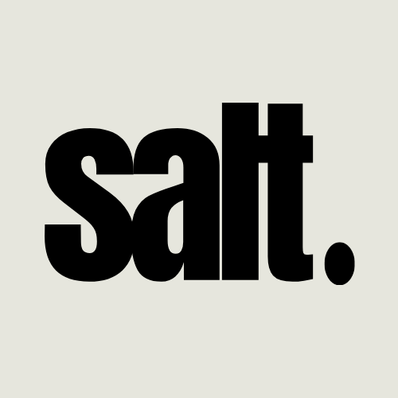

<!-- Adicione Badges das tecnologias que você usou aqui -->
<!-- Você pode encontrar badges aqui: https://github.com/Ileriayo/markdown-badges?tab=readme-ov-file#markdown-badges -->

**Este projeto foi desenvolvido como atividade final do curso de capacitação em Python da Cyber Edux, realizado de setembro de 2023 até março de 2024. Para mais informações, consulte o [enunciado](ENUNCIADO.md).**

# Salt

<!-- Substitua a seguinte imagem por uma logo do seu projeto -->

<!-- Substitua o seguinte parágrafo por um resumo do seu projeto: -->
O site “Salt”, tem por finalidade facilitar a criação de cadastros no 
Restaurante Universitário, disponibilizando uma plataforma mais abrangedora, onde o aluno faz a solicitação do 
cadastro - deve ser realizado o upload do comprovante da matrícula (para 
comprovar que o usuário é aluno da Instituição X) e do documento original (RG) com foto 
(para comprovar a identificação do aluno) - e o Administrador responsável por avaliar 
a solicitação, aceitando-a ou não.

## Documentação

* [Documentação (para desenvolvedores)](DOCUMENTACAO.md)
* [Manual (para usuários)](MANUAL.md)

## Sobre o autor

<!-- Coloque seu nome, uma foto sua e uma pequena bio sobre você na seguinte tabela: -->
|  |  |
|:-------------:|:------------------------------------------------------------:|
|    **Kamila Antonia** | Entusiasta a artista |
